# Consensus

## What is Consensus?

Consensus is the means by which a series of independent voters (often called “validators”) come to an agreement on a decision. At a glance, the process sounds straightforward: figure out if a piece of data is consistent with the rules of their system and whether the rest of the network agrees with their assessment.

Consensus protocols (like Avalanche) facilitate agreement between all of the validators, ensuring that the network has a synchronized view on the data. Robust consensus protocols work even if some validators in the network are faulty or malicious.

At the end of this process, all nodes will share the same data, referred to as “state”, that was agreed on in this decision-making process. If a conflicting transaction goes through on any node and it’s not in full agreement with the rest of the network, this is called a “safety violation.” This means that at least one machine is inconsistent with the other machines in the network. The purpose of consensus protocols is to minimize the chance safety violations on the network, preferably to the point where it’s incredibly unlikely.

Simple enough concept, right? Yet the topic of _consensus protocols_ is one of the hardest areas in computer science.

## History of Consensus

Over the 45-year history of distributed systems, there have been only three approaches to the consensus problem: Classical, Nakamoto, and Avalanche. Let’s discuss these three approaches, to illustrate what sets them apart from each other and determine their respective strengths and weaknesses.

### Classical Protocols

Classical consensus protocols, such as Practical Byzantine Fault Tolerance (PBFT) and HotStuff, are based on all-to-all voting. This means that a validator needs to hear from a vast set of nodes that comprise the network to come to a decision. In addition, they are “probability of 1”, or P=1, protocols, which means that the network agrees on a decision with absolute certainty. Transactions finalize immediately after a node has received responses from the requisite fraction of the nodes that comprise the system.

Classical consensus has two major problems in open, Internet-like settings. The first problem is that these protocols are fragile: their correctness depends heavily on everyone in the system knowing and agreeing on the identities of the validators that comprise the system at any one point. As a result, any errors in maintaining membership in the system, or any difference in the views of the network can lead to safety violations. Further, an attacker only needs control of 33% of the network in order to launch a double-spend attack that is guaranteed to succeed.

Second, these systems, while fast, do not scale well in the number of participants. The most scalable Classical protocol, HotStuff (incidentally designed by [Ted Yin](https://twitter.com/Tederminant), who is now working on the Avalanche protocol) used by Facebook’s Diem (previously Libra), only supports approximately 100 validators before the performance begins to suffer.

These two flaws make Classical consensus an unviable candidate for open and permissionless networks where nodes may join and leave at-will and nodes may behave adversarially to the network’s intent.

### Nakamoto Consensus

For over a decade, practical Byzantine fault-tolerant systems were a novelty because Classical consensus couldn’t scale to handle global needs. Then, out of nowhere, Satoshi Nakamoto came along and dropped the [Bitcoin whitepaper](https://bitcoin.org/bitcoin.pdf) and showed the world it was possible to create an adversary-resistant consensus protocol that worked at a global scale. Nakamoto accomplished this by redefining the consensus problem and making the correctness definition probabilistic.

With Nakamoto-based protocols, instead of waiting for absolute certainty across all nodes in the network, Nakamoto trades off an indistinguishable difference in probability for greater scalability. Where classical protocols must reach consensus with a probability of 1 (P=1), Nakamoto reaches consensus with a probability of 1 minus some teeny tiny chance of error (P=1 — ε). In Nakamoto, this error value is made smaller and smaller over time as more blocks are produced. The more blocks, the chances of a reorganization drop exponentially.

Nakamoto is undeniably a breakthrough as a robust, global protocol, but it does have drawbacks. It’s slow, consumes a lot of energy, and takes a very long time to feel confident in a transaction’s finality. While those are acceptable downsides for an asset that moves infrequently or acts as a reserve, they are too much of a burden for use cases like peer-to-peer payments and decentralized finance.

### Avalanche

In the wake of Nakamoto’s work, the world still wanted a protocol with all of the benefits of Nakamoto consensus (robustness, scale, decentralization) and all the benefits of Classical consensus (speed, quick finality, and energy efficiency). Crypto’s own version of the proverbial, “have your cake and eat it too.”

Then, in May of 2018, a paper was distributed by a pseudonymous group named Team Rocket that proposed a third class of consensus protocol they dubbed “Avalanche.” With all the benefits of Classical consensus and the massive decentralization of Nakamoto consensus, it proved that Classical protocols can be generalized to behave probabilistically and gain massive performance improvements as a result.

<p style="text-align:center;">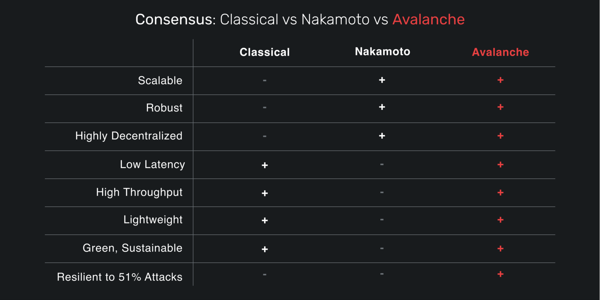</p>

### What is Avalanche Consensus?

Avalanche consensus, like Nakamoto consensus, is a probabilistic protocol. Just as Nakamoto traded off a small chance in probability for performance, Avalanche embraces probability to make the chance of error just as microscopic (and better yet, like all parts of Avalanche, configurable by validators on custom subnets).

Avalanche can make the error so small that it is even less likely that a safety violation will occur on an Avalanche node than the odds of finding a SHA-256 hash collision. To put this in greater perspective, it’s dozens of orders of magnitude more likely that a life-ending asteroid will collide with the Earth in the next hundred years than a SHA-256 collision is detected in the next thousand years by a network computing 1 quintillion hashes a second. That’s really safe!

Avalanche also finalizes all transactions immediately, without waiting for confirmations. Avalanche is able to do so because it’s a generalization over Classical consensus, so it inherits this very desirable property. In fact, Avalanche sees transactions finalize in less than a second on average. This is blazingly fast compared to existing decentralized networks.

As a generalized Classical consensus with probabilistic models factored in, Avalanche also has the property of being both CPU-bound and high-throughput. It doesn’t require specialized (read: expensive) hardware to reach high-performance numbers in excess of 4,500 transactions per second. That means the computer you already have (or even the one collecting dust in your closet) is powerful enough to run Avalanche. The combination makes Avalanche nodes both extremely green and economical.

Better yet, like Nakamoto consensus, there’s no known cap on how many individuals can participate in the network at its deepest levels — the same can’t be said for Classical protocols whose performance degrades exponentially with greater participation (more in the advanced note below). For all the talk about making these networks accessible to the masses, Avalanche is peerless in this regard.

Avalanche does not depend on Proof of Work like Nakamoto consensus. In protocols like Bitcoin, Proof of Work is necessary for both organization and security against dishonest actors. Avalanche could use Proof of Work but chose Proof of Stake to force users to have some amount of tokens before being allowed to vote on transactions.

Finally, unlike Bitcoin and other systems based on Nakamoto’s work that requires perpetual action, Avalanche nodes only work when there is work to be done. There’s no mining or polling to get new blocks. Transactions are broadcast to the wider network, who then hears them and begins voting. If there are no transactions to vote on, the nodes in the network don’t do anything except listen until new transactions are heard. Simply put, Avalanche works smarter, not harder.

_Advanced note: The most important property of Avalanche, which really sets it far apart from existing Classical protocols, is that like Nakamoto consensus, it can operate with no known upper-bound of participants in the network. Decisions in Avalanche can be made in O(1) (constant number) of messages per node. Compare this with Classical protocols which take O(n²) messages to reach consensus and the network scaling issues that faced Classical go away in Avalanche._

### How Avalanche Consensus Works

To start, let’s talk about what a validator does in Avalanche consensus. Avalanche is a voting protocol. Validators listen for transactions. When they hear a transaction, they vote on whether a transaction is to be “Accepted”, and if it is not, it is marked “Rejected”. Transactions that appear virtuous will be voted on as “Accepted” by a validator. If it is conflicting, the transaction will be voted on as “Rejected”. That’s the sum of it. A validator sees a decision, makes an initial decision, and then collaborates with the rest of the network to determine whether the network agrees with this decision. This is the same expectation in Classical voting protocols, but in Avalanche this happens on much higher validator counts.

This voting process in Avalanche is what makes it so unique. Each validator is a completely independent decision-maker. There is no leader election. However, by protocol, each node uses the same process to determine whether a decision is virtuous and how likely they are in consensus with the rest of the network. Once they see a high probability of agreement across the network, the node locks in their vote and accepts a transaction as final.

The process used to determine whether a transaction is preferred and that the rest of the network agrees on this decision is referred to as “repeated random subsampling”.

At a high-level, this means a validator randomly selects other validators to ask them what they like. It does this over and over again on new randomly selected nodes until it builds up enough data to determine that its probability of being correct is so high you may as well consider it impossible that it’s wrong.

In more detail, it works as follows:

1. A validator is presented with a set of transactions that have been issued and asked to decide which transactions to “Accept.”
2. The node client presents the virtual machines (“VMs”) with their transactions, and the VMs will provide information to help the client determine which transactions are acceptable.
3. The validator selects a subset of these transactions that do not conflict, marks them as preferred, and attempts to accept them over the network.
4. Any nodes that query this validator receives its latest preferred choice for this decision.
5. This validator selects K nodes from the entire validator list (probability of selection is weighted by stake amount) to query for their preferred decision.
6. Each queried validator responds with their preferred decisions, the validator’s votes are updated accordingly, and confidence is built.
7. Meanwhile, other nodes are also selecting random validators from the validator set to be queried for their preferred response and updating their answers accordingly.
8. This continues for at least M rounds or until a sufficient confidence threshold is reached, whatever comes last, with K validators selected randomly each round (without replacement).
9. Once a confidence threshold is reached, the decision on the transaction is locked in as final.
10. If “Accepted”, the transaction is sent to the VM to be handled; if “Rejected”, the transaction is removed from consensus.

<p style="text-align:center;">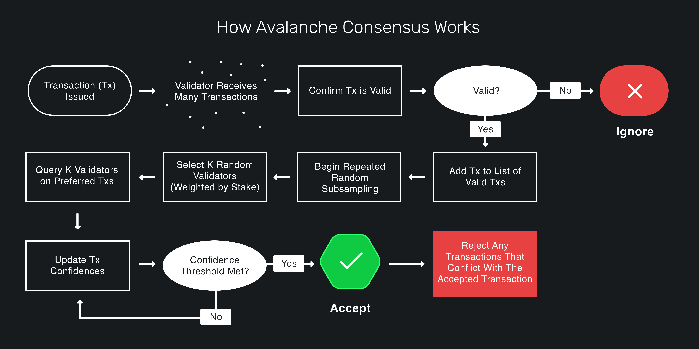</p>

The Team Rocket whitepaper showed that with correct parameterization, a network will come to the same decision using this process to a parameterizable probability.

## Probabilistic Finality

There’s a need by scientists to have certainty in their models. It’s very nice and neat to be able to say, “this is absolutely true beyond a shadow of a doubt,” when describing a system or process. Classical protocols strive toward this idyllic model, but in the real world, nothing is certain.

With 100 machines in a Classical network, there’s a chance that 33% of them could all go offline at once or that someone socially takes over 33% of them and tries to impose their will on the network. There’s also a non-zero probability that all the oxygen in a room will jump to the other side through random collisions and cause anyone misfortunate enough to be on the wrong side to suffocate in a pool of nitrogen. It’s possible, but the probabilities are so low as to not be a concern for anyone.

Nakamoto continues to demonstrate to the world that probabilistic finality is acceptable, as long as the chance of a safety failure is so astronomically remote that if one occurs it would be more fascinating than the network having a little hiccup for a bit. The world finds that as an acceptable service level. Heck, that’s way better than five nines (99.999%) that you get with carrier-grade SLAs.

Avalanche, by accepting this same minor margin of error, is accepting the chance of error once in 20,000 years in the model with the right parameters. It’s more likely that aging internet infrastructure causes massive network outages. It was this key insight that helped Team Rocket to pave the way for a new consensus protocol which scales tremendously better than existing Classical networks.

## Staking

Staking is the process of locking up tokens to support a network while receiving a reward in return \(rewards can be increased network utility, monetary compensation, etc.\). The concept of staking was [first formally introduced](https://web.archive.org/web/20160306084128/https://peercoin.net/assets/paper/peercoin-paper.pdf) by Sunny King and Scott Nadal of Peercoin.

### How does proof-of-stake work?

To resist [sybil attacks](https://support.avalabs.org/en/articles/4064853-what-is-a-sybil-attack), a decentralized network must require that network influence is paid with a scarce resource. This makes it infeasibly expensive for an attacker to gain enough influence over the network to compromise its security. In proof-of-work systems, the scarce resource is computing power. On Avalanche, the scarce resource is the native token, [AVAX](../../#avalanche-avax-token). For a node to [validate](http://support.avalabs.org/en/articles/4064704-what-is-a-blockchain-validator) a blockchain on Avalanche, it must stake AVAX.

## Staking Parameters on Avalanche

When a validator is done validating the [Primary Network](http://support.avalabs.org/en/articles/4135650-what-is-the-primary-network), it receives back the AVAX tokens it staked. It may receive a reward for helping to secure the network. A validator only receives a [validation reward](http://support.avalabs.org/en/articles/4587396-what-are-validator-staking-rewards) if it is sufficiently responsive and correct during the time it validates. Read the [Avalanche token whitepaper](https://files.avalabs.org/papers/token.pdf) to learn more about AVAX and the mechanics of staking.

Staking rewards are sent to your wallet address at the end of the staking term **as long as all of these parameters are met**.

* The minimum amount that a validator must stake is 2,000 AVAX
* The minimum amount that a delegator must delegate is 25 AVAX
* The minimum amount of time one can stake funds for validation is 2 weeks
* The maximum amount of time one can stake funds for validation is 1 year
* The minimum amount of time one can stake funds for delegation is 2 weeks
* The maximum amount of time one can stake funds for delegation is 1 year
* The minimum delegation fee rate is 2%
* The maximum weight of a validator \(their own stake + stake delegated to them\) is the minimum of 3e6 AVAX and 5 times the amount the validator staked. For example, if you staked 2,000 AVAX to become a validator, only 8000 AVAX can be delegated to your node total \(not per delegator\)
* The minimum percentage of the time a validator must be correct and online in order to receive a reward is 60%

## Validators

**Validators** secure Avalanche, create new blocks/vertices, and process transactions. To achieve consensus, validators repeatedly sample each other. The probability that a given validator is sampled is proportional to its stake.

When you add a node to the validator set, you specify:

* Your node’s ID
* When you want to start and stop validating
* How many AVAX you are staking
* The address to send any rewards to
* Your delegation fee rate \(see below\)

The minimum amount that a validator must stake is 2,000 AVAX.

Note that once you issue the transaction to add a node as a validator, there is no way to change the parameters. **You can’t remove your stake early or change the stake amount, node ID, or reward address.** Please make sure you’re using the correct values in the API calls below. If you’re not sure, ask for help on [Discord](https://chat.avax.network) or browse our [Developer FAQs](http://support.avalabs.org/en/collections/2618154-developer-faq).

### Running a Validator

If you’re running a validator, it’s important that your node is well connected to ensure that you receive a reward. When you issue the transaction to add a validator, the staked tokens and transaction fee are deducted from the addresses you control. When you are done validating, the staked funds are returned to the addresses they came from. If you earned a reward, it is sent to the address you specified when you added yourself as a validator.

#### Allow API calls

To make API calls to your node from remote machines, allow traffic on the API port \(`9650` by default\), and run your node with argument `--http-host=`

You should disable all APIs you will not use via command-line arguments. You should configure your network to only allow access to the API port from trusted machines \(e.g., your personal computer.\)

#### Why is my uptime low?

Every validator on Avalanche keeps track of the uptime of other validators. You can see the connections a node has by calling `info.peers`, as well as the uptime of each connection. **This is only one node’s point of view**. Other nodes may perceive the uptime of your node differently. Just because one node perceives your uptime as being low does not mean that you will not receive staking rewards.

The likely reason that your node is not connected to another node is that NAT traversal failed, and you did not start your node with `--public-ip=[NODE'S PUBLIC IP]`. In the future, we will add better monitoring to make it easier to verify that your node is well-connected.

#### Secret Management

The only secret that you need on your validating node is its Staking Key, the TLS key that determines your node’s ID. The first time you start a node, the Staking Key is created and put in `$HOME/.avalanchego/staking/staker.key`. You should back up this file \(and `staker.crt`\) somewhere secure. Losing your Staking Key could jeopardize your validation reward, as your node will have a new ID.

You do not need to have AVAX funds on your validating node. In fact, it's best practice to **not** have a lot of funds on your node. Almost all of your funds should be in “cold" addresses whose private key is not on any computer.

## Delegators

A delegator is a token holder, who wants to participate in staking, but chooses to trust an existing validating node through delegation.

When you delegate stake to a validator, you specify:

* The ID of the node you’re delegating to
* When you want to start/stop delegating stake \(must be while the validator is validating\)
* How many AVAX you are staking
* The address to send any rewards to

The minimum amount that a delegator must delegate is 25 AVAX.

Note that once you issue the transaction to add your stake to a delegator, there is no way to change the parameters. **You can’t remove your stake early or change the stake amount, node ID, or reward address.** If you’re not sure, ask for help on [Discord](https://chat.avax.network) or browse our [Developer FAQs](http://support.avalabs.org/en/collections/2618154-developer-faq).

### Delegator rewards

If the validator that you delegate tokens to is sufficiently correct and responsive, you will receive a reward when you are done delegating. Delegators are rewarded according to the same function as validators. However, the validator that you delegate to keeps a portion of your reward–specified by the validator’s delegation fee rate.

When you issue the transaction to delegate tokens, the staked tokens and transaction fee are deducted from the addresses you control. When you are done delegating, the staked tokens are returned to your address. If you earned a reward, it is sent to the address you specified when you delegated tokens.

### A Scalable, Decentralized Future with Avalanche

Classical practical Byzantine fault-tolerant protocols showed that a network can come to consensus despite adversary participants. Nakamoto protocols showed that probabilistic protocols are safe in practice and can provide unprecedented decentralization and robustness.

Avalanche takes these revelations and combines them into a new protocol, showing that you can have the best of both Classical and Nakamoto without the downsides that come with either class of protocols.

By having a validator randomly select other validators in order to ask them what their preferences are, participants in Avalanche build confidence in the correct decision shared by all nodes in the network. With enough confidence, a decision is finalized immediately. This process happens so quickly that Avalanche rivals major payment systems in its ability process and clear transactions in a network.

## Avalanche Consensus Deep Dive

Avalanche consensus is a radical breakthrough in distributed systems. It represents as large a leap forward as the classical and Nakamoto consensus protocols that came before it. Now that you have a better understanding of consensus let's take a much deeper look at how Avalanche Consensus works.

### Intuition

First, let's develop some intuition about the protocol. Imagine a room full of people trying to agree on what to get for lunch. Suppose it's a binary choice between pizza and barbecue. Some people might initially prefer pizza while others initially prefer barbecue. Ultimately, though, everyone's goal is to achieve consensus.

Everyone asks a random subset of the people in the room what their lunch preference is. If more than half say pizza, the person thinks, "Ok, looks like things are leaning toward pizza. I prefer pizza now." That is, they adopt the preference of the majority. Similarly, if a majority say barbecue, the person adopts barbecue as their preference.

Everyone repeats this process. Each round, more and more people have the same preference. This is because the more people that prefer an option, the more likely someone is to receive a majority reply and adopt that option as their preference. After enough rounds, they reach consensus and decide on one option, which everyone prefers.

### Snowball

The intuition above outlines the Snowball Algorithm, which is a building block of Avalanche consensus. Let's review the Snowball algorithm.

Parameters

* _n_: number of participants
* _k_ (sample size): between 1 and _n_
* α (quorum size): between 1 and _k_
* β (decision threshold): >= 1

### Algorithm

```text
preference := pizza
consecutiveSuccesses := 0
while not decided:
  ask k random people their preference
  if >= α give the same response:
    preference := response with >= α
    if preference == old preference:
      consecutiveSuccesses++
    else:
      consecutiveSuccesses = 1
  else:
    consecutiveSuccesses = 0
  if consecutiveSuccesses > β:
    decide(preference)
```

### Algorithm Explained

Everyone has an initial preference for pizza or barbecue. Until someone has _decided_, they query _k_ people \(the sample size\) and ask them what they prefer. If α or more people give the same response, that response is adopted as the new preference. α is called the _quorum size_. If the new preference is the same as the old preference, the `consecutiveSuccesses` counter is incremented. If the new preference is different then the old preference, the `consecutiveSucccesses` counter to `1`. If no response gets a quorum \(an α majority of the same response\) then the `consecutiveSuccesses` counter is set to `0`.

Everyone repeats this until they get a quorum for the same response β times in a row. If one person decides pizza, then every other person following the protocol will eventually also decide on pizza.

Random changes in preference, caused by random sampling, cause a network preference for one choice, which begets more network preference for that choice until it becomes irreversible and then the nodes can decide.


For a great visualization, check out [this demo](https://tedyin.com/archive/snow-bft-demo/#/snow) from Ava Labs' Co-Founder Ted Yin.


In our example, there is a binary choice between pizza or barbecue, but Snowball can be adapted to achieve consensus on decisions with many possible choices.

The liveness and safety thresholds are parameterizable. As the quorum size, α, increases, the safety threshold increases, and the liveness threshold decreases. This means the network can tolerate more byzantine \(deliberately incorrect, malicious\) nodes and remain safe, meaning all nodes will eventually agree whether something is accepted or rejected. The liveness threshold is the number of malicious participants that can be tolerated before the protocol is unable to make progress.

These values, which are constants, are quite small on the Avalanche Network. The sample size, _k_, is `20`. So when a node asks a group of nodes their opinion, it only queries `20` nodes out of the whole network. The quorum size, α, is `14`. So if `14` or more nodes give the same response, that response is adopted as the querying node's preference. The decision threshold, β, is `20`. A node decides on choice after receiving `20` consecutive quorum \(α majority\) responses.

Snowball is very scalable as the number of nodes on the network, _n_, increases. Regardless of the number of participants in the network, the number of consensus messages sent remains the same because in a given query, a node only queries `20` nodes, even if there are thousands of nodes in the network.

## DAGs \(**D**irected **A**cyclic **G**raphs\)

Now let's introduce a data structure called a DAG or Directed Acyclic Graph. A DAG gives a **partial ordering** of decisions. For example, check out the DAG in this diagram:

<p style="text-align:center;">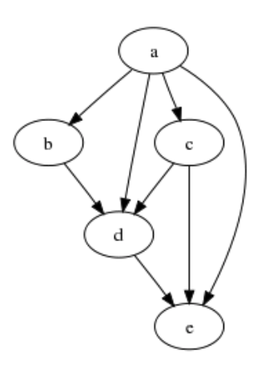</p>

**a** is before **b**. **b** is before **d**. **d** is before **e**. Transitively, we can say that **a** comes before **e**. However, since this is a partial ordering: for some elements, ordering is not defined. For example, both **b** and **c** are after **a** but there is no notion of whether **b** is before or after **c**.

Two additional DAG related concepts are **ancestors** and **descendants**. Ancestors are any nodes in the DAG which you can draw a line up to. For example, the ancestors of **d** are **a**, **b**, and **c**. The ancestors of **e** are **a**, **b**, **c**, and **d**. Descendants are the opposite of ancestors. The descendants of **a** are **b**, **c**, **d**, and **e**. The descendants of **b** are **d** and **e**.

Both Bitcoin and Ethereum, for example, have a linear chain where every block has one parent and one child. Avalanche uses a DAG to store data rather than a linear chain. Each element of the DAG may have multiple parents. The parent-child relationship in the DAG does not imply an application-level dependency.

In a consensus protocol, the name of the game is to prevent the inclusion of **conflicting transactions** into the DAG. Conflicts are application-defined. Different applications will have different notions about what it means for two transactions to conflict. For example, in a P2P payment system, transactions that consume the same UTXO \([Unspent Transaction Output](https://en.wikipedia.org/wiki/Unspent_transaction_output)\) would conflict. In Avalanche every transaction belongs to a **conflict set** which consists of conflicting transactions. Only one transaction in a conflict set can be included in the DAG. Each node **prefers** one transaction in a conflict set.

## Working Example

Suppose we have an Avalanche network running with the following parameters. The sample size, _k_, is `4`. The quorum size, α, is `3`. The number of consecutive success, β, is `4`.

<p style="text-align:center;">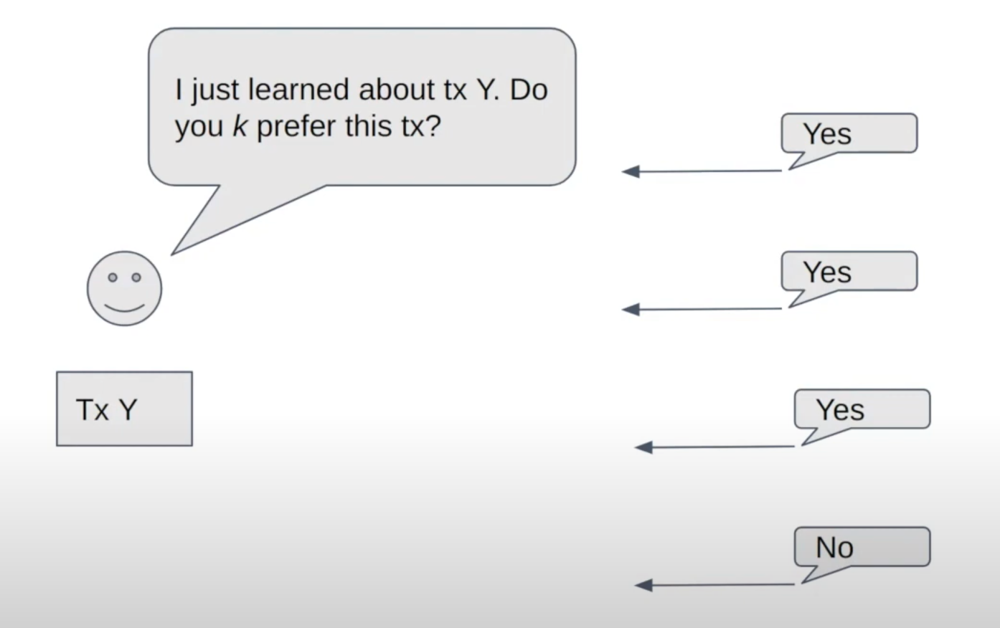</p>

A node finds out about a new transaction **Y**. It queries the network based on the above parameters. It queries _k_ \(`4`\) validators and asks, "Do you prefer this transaction?" It gets back responses—three of them say **yes** and one of them says **no**. The quorum size, α, is `3` so there is an α majority \(quorum\) of yes responses. Now we the node updates its DAG.

<p style="text-align:center;">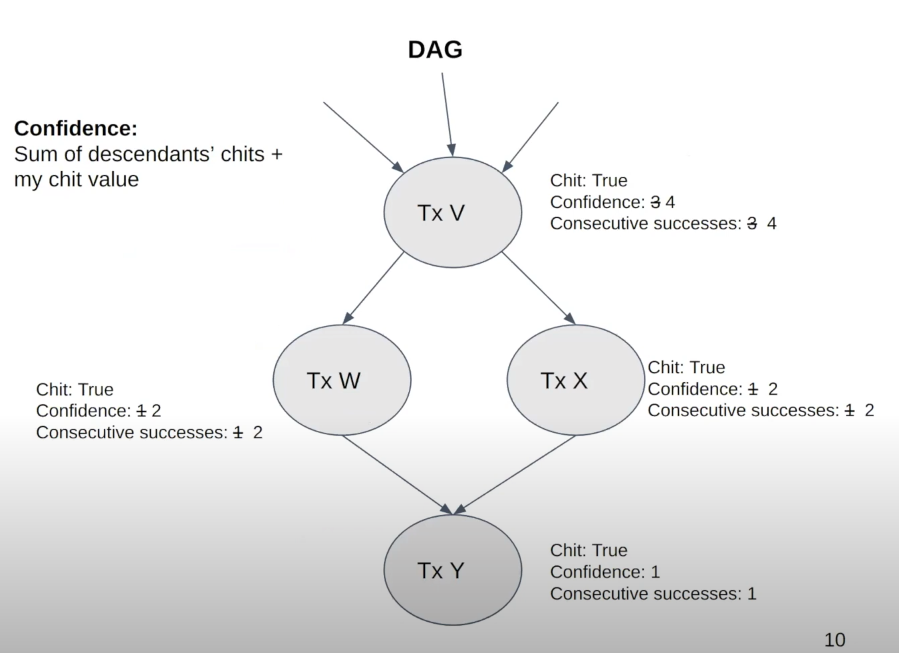</p>

If a node gets an α majority response for a transaction then you give that transaction a **chit**, which is a boolean that says, "When I queried the network about this transaction, an α majority said that they preferred it." In our example, transaction Y gets a chit.

There is also a notion of **confidence**, which is the sum of a vertex's chit plus the sum of its descendants' chits. For example, transaction **V** has a chit. It also has three descendants which have a chit so its confidence is increased from `3` to `4`. Similarly, transactions **W** and **X** both have a chit and they both have a descendant with a chit, so they each have confidence `2`. Transaction Y has confidence `1`.

**Consecutive successes** are the same as in Snowball. It's the number of times that a transaction, or a descendant of the transaction, received a successful α majority query response. Previously, transaction V had `3` consecutive successes, itself and its two children, and now it has `4` consecutive successes with transaction Y. Similarly for transactions W and X.

<p style="text-align:center;">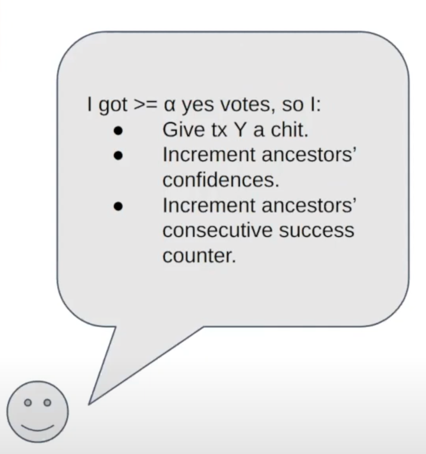</p>

In this example we the acceptance threshold, β, is `4`. Transaction V has `4` consecutive success so it's **accepted**. This node is sure that every other correct node will eventually accept this transaction.

<p style="text-align:center;">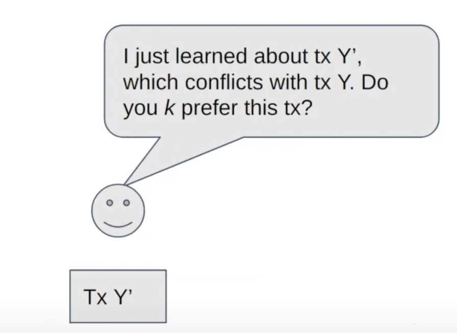</p>

Now suppose the node learns about transaction **Y'** which conflicts with transaction Y. It follows the same steps as before and subsamples _k_ \(`4`\) validators and asks if they prefer transaction Y'. In this case, two of them say that they prefer Y' and two of them say that they do not prefer Y'. This time there is no α majority response, and the DAG is updated accordingly.

<p style="text-align:center;">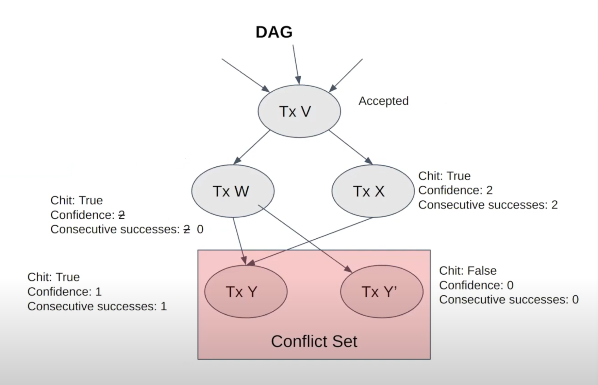</p>

Transactions Y and Y' are in a conflict set; only one of them can ultimately get accepted. Transaction Y' doesn't get a chit because it didn't get an α majority response. It has confidence `0` because it doesn't have a chit and it doesn't have any descendants with a chit. It has `0` consecutive successes because the previous query didn't get an α majority response. W's consecutive success counter goes from `2` to `0`. Its confidence is still `2`.

When a node is asked whether it prefers a given transaction, it replies yes if that transaction has the highest confidence of any transaction in the transaction's conflict set. In this example, transaction Y has confidence `1` and transaction Y' has confidence `0` so the node prefer transaction Y to transaction Y'.

<p style="text-align:center;">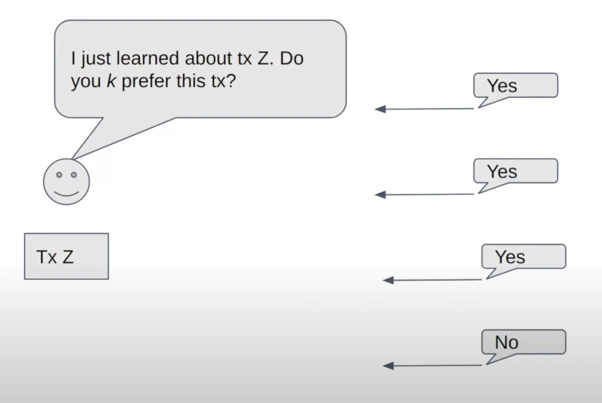</p>

Now the node learns about a new transaction, **Z**, and it does the same thing as before. It queries _k_ nodes, gets back an α majority response, and updates the DAG.

<p style="text-align:center;">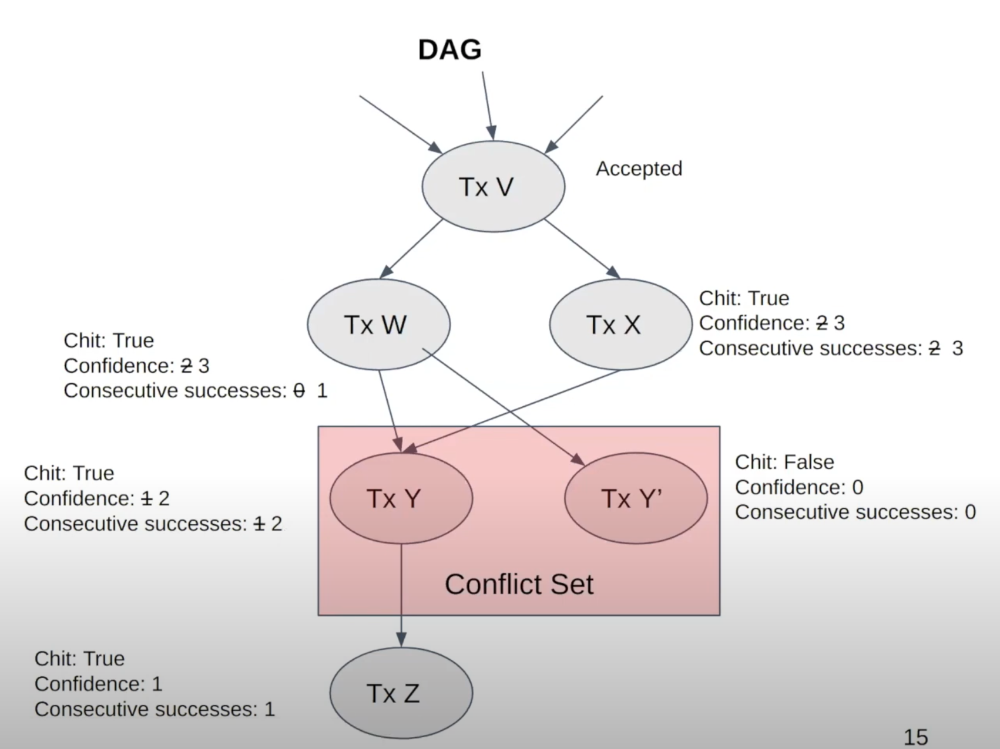</p>

Transaction Z gets a chit. It also has a confidence of `1` and `1` consecutive success. The processing ancestors are updated, too. No transactions have `4` consecutive successes so no ancestors are accepted.

## Vertices

Everything discussed to this point is how Avalanche is described in [the Avalanche whitepaper](https://assets-global.website-files.com/5d80307810123f5ffbb34d6e/6009805681b416f34dcae012_Avalanche%20Consensus%20Whitepaper.pdf). The implementation of the Avalanche consensus protocol by Ava Labs \(namely in AvalancheGo\) has some optimizations for latency and throughput. The most important optimization is the use of **vertices**. A vertex is like a block in a linear blockchain. It contains the hashes of its parents, and it contains a list of transactions. Vertices allow transactions to be batched and voted on in groups rather than one by one. The DAG is composed of vertices, and the protocol works very similar to how it's described above.

If a node receives a vote for a vertex, it counts as a vote for all the transactions in a vertex, and votes are applied transitively upward. A vertex is accepted when all the transactions which are in it are accepted. If a vertex contains a rejected transaction then it is rejected and all of its descendants are rejected. If a vertex is rejected, any valid transactions are re-issued into a new vertex which is not the child of a rejected vertex. New vertices are appended to preferred vertices.

## Finality

Avalanche consensus is probabilistically safe up to a safety threshold. That is, the probability that a correct node accepts a transaction that another correct node rejects can be made arbitrarily low by adjusting system parameters. In Nakamoto consensus protocol \(as used in Bitcoin and Ethereum, for example\), a block may be included in the chain but then be removed and not end up in the canonical chain. This means waiting an hour for transaction settlement. In Avalanche, acceptance/rejection are **final and irreversible** and take a few seconds.

## Optimizations

It's not efficient for nodes to just ask, "Do you prefer this vertex?" when they query validators. In Ava Labs' implementation, during a query a node asks, "Given that this vertex exists, which vertices do you prefer?" Instead of getting back a binary yes/no, the node receives the other node's preferred vertex set.

Nodes don't only query upon hearing of a new transaction. They repeatedly query until there are no virtuous vertices processing. A virtuous vertex is one that has no conflicts.

Nodes don't need to wait until they get all _k_ query responses before registering the outcome of a poll. If no transaction can get an α majority then there's no need to wait for the rest of the responses.

## Validators

If it were free to become a validator on the Avalanche network, that would be problematic because a malicious actor could start many, many nodes which would get queried very frequently. The malicious actor could make the node act badly and cause a safety or liveness failure. The validators, the nodes which are queried as part of consensus, have influence over the network. They have to pay for that influence with real-world value in order to prevent this kind of ballot stuffing. This idea of using real-world value to buy influence over the network is called Proof of Stake.

To become a validator, a node must **bond** \(stake\) something valuable \(**AVAX**\). The more AVAX a node bonds, the more often that node is queried by other nodes. When a node samples the network it's not uniformly random. Rather, it's weighted by stake amount. Nodes are incentivized to be validators because they get a reward if, while they validate, they're sufficiently correct and responsive.

Avalanche doesn't have slashing. If a node doesn't behave well while validating, such as giving incorrect responses or perhaps not responding at all, its stake is still returned in whole, but with no reward. As long as a sufficient portion of the bonded AVAX is held by correct nodes, then the network is safe, and is live for virtuous transactions.

## Big Ideas

Two big ideas in Avalanche are **subsampling** and **transitive voting**. Subsampling has low message overhead. It doesn't matter if there are twenty validators or two thousand validators; the number of consensus messages a node sends during a query remains constant.

<p style="text-align:center;">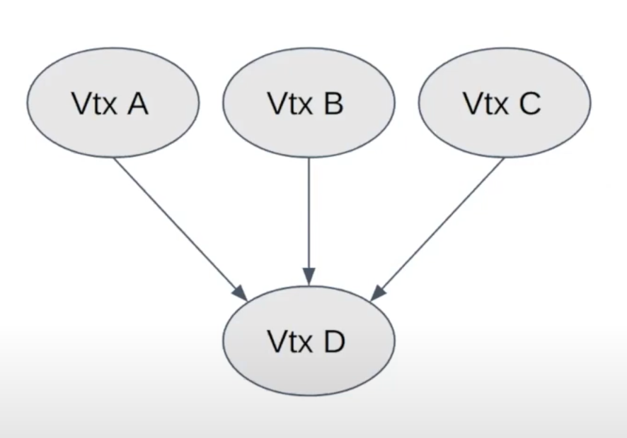</p>

Transitive voting, where a vote for a vertex is a vote for all it's ancestors, helps with transaction throughput. Each vote is actually many votes in one. For example, in the above diagram, if a node gets a vote for vertex **D**, that implies a vote for all it's ancestors; a vote for **D** is also a vote for **A**, **B**, and **C**.

## Loose Ends

Transactions are created by users which call an API on the [AvalancheGo](https://github.com/ava-labs/avalanchego) full node or create them using a library such as [AvalancheJS](https://github.com/ava-labs/avalanchejs). Vertices are created when nodes batch incoming transactions together or when accepted transactions from a rejected vertex get reissued and added to the DAG. A vertex's parents are chosen from the virtuous frontier, which are the nodes at the tip of the DAG with no conflicts. It's important to build on virtuous vertices because if we built on non-virtuous vertices there would be a higher chance that the node would get rejected which means there's a higher chance it's ancestors get rejected and we would make less progress.

## Other Observations

Conflicting transactions are not guaranteed to be live. That's not really a problem because if you don't want your transaction to not be live then don't issue a conflicting transaction.

Avalanche works for linear chains too. The protocol is largely the same as above, but each vertex has only have one parent. This gives a total ordering of vertices. This is useful for certain applications where one needs to know if a transaction came before another transaction, such as with smart contracts. Snowman is the name of Ava Labs' implementation of the Avalanche consensus protocol for linear chains.

If there are no undecided transactions, the Avalanche consensus protocol _quiesces_. That is, it does nothing if there is no work to be done. Avalanche is more sustainable than Proof-of-work where nodes need to constantly do work.

Avalanche has no leader. Any node can propose a transaction and any node that has staked AVAX can vote on every transaction, which makes the network more robust and decentralized.

## Why Do We Care?

Avalanche is a general consensus engine. It doesn't matter what type of application is put on top of it. The protocol allows the decoupling of the application layer from the consensus layer. If you're building a Dapp on Avalanche then you just need to define a few things, like how conflicts are defined and what is in a transaction. You don't need to worry about how nodes come to an agreement. The consensus protocol is a black box that put something into it and it comes back as accepted or rejected.

Avalanche can be used for all kinds of applications, not just P2P payment networks. Avalanche's Primary Network has an instance of the Ethereum Virtual Machine, which is backward compatible with existing Ethereum Dapps and dev tooling. The Ethereum consensus protocol has been replaced with Avalanche consensus to enable lower block latency and higher throughput.

Avalanche is very performant. It can process thousands of transactions per second with one to two second acceptance latency.
