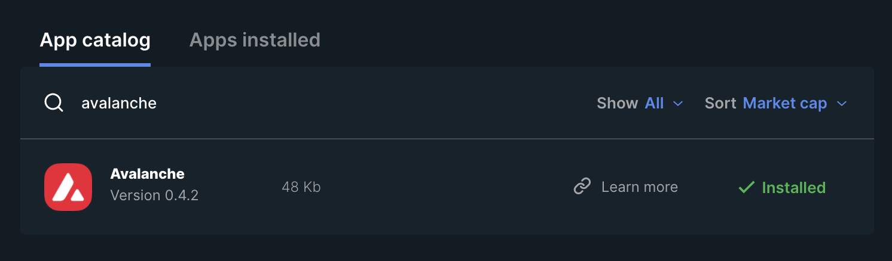

# Introduction

## What is Avalanche?

Avalanche is the official name of the Distributed Ledger Technology (DLT) that is being built as an open source project led by [Ava Labs](https://www.avalabs.org). Avalanche is often referred to as a Layer 1 (L1) network or simply as a 'Blockchain'. The source code is [BSD 3-Clause licensed](https://github.com/ava-labs/avalanchego/blob/master/LICENSE) and is available on [Github](https://github.com/ava-labs/avalanchego) and the community is encouraged to contribute.

Avalanche is also the name of the 'Proof of Stake' (PoS) consensus protocol utilised in the Avalanche network.

Avalanche can be utilised as an open-source platform for launching public or private decentralised applications.

Avalanche is the first 'Smart Contracts' capable network that can processes over 4,500 transactions per second with instant confirmations and high-throughput. Ethereum developers can quickly build on Avalanche as [Solidity](https://docs.soliditylang.org) the programming language of the Ethereum Virtual Machine (EVM) works out-of-the-box.

A key difference between Avalanche and other L1 networks (like Ethereum) is that the consensus protocol: Avalanche and Snowman are breakthroughs in computer science.

The Avalanche protocol employs a novel approach to consensus to achieve its strong safety guarantees, quick finality, and high-throughput all without compromising decentralisation. It brings together the best of Classical and Nakamoto consensus without any of their their drawbacks.

Avalanche is a network of networks consisting of subnets, dynamic sets of validators working together to come into consensus on the state of a set of blockchains. Each subnet contains blockchains which are instances of virtual machines. There is a primary or default subnet which consists of the P, X and C chains.

<small>The table below demonstrates the function of each subnet within the Avalanche primary network.</small>

| Subnet | Purpose |
|:--|:--|
| Platform (P) | The P-Chain is the metadata blockchain on Avalanche and coordinates validators, keeps track of active subnets, and enables the creation of new subnets. The P-Chain implements the Snowman consensus protocol. |
| eXchange (X) | The X-Chain acts as a decentralised platform for creating and trading digital smart assets, a representation of a real-world resource (e.g., equity, bonds) with a set of rules that govern its behaviour, like “can’t be traded until tomorrow” or “can only be sent to US citizens.” |
| Contract (C) | The C-Chain allows for the creation smart contracts using the C-Chain’s API. The C-Chain is an instance of the Ethereum Virtual Machine powered by Avalanche. |

## What is AVAX?

AVAX is the native asset (token) of the Avalanche network. It is used as a unit of account.

AVAX is hard-capped at 720,000,000 and all transaction fees are burned which makes it a deflationary asset.

Transaction fees and staking rewards all utilise AVAX. One AVAX is denomination nine, so the smallest unit of AVAX is nanoAVAX (nAVAX) at 10^-9 AVAX.

## History of Avalanche

## Getting Started

## Choosing an Avalanche Wallet

### Web Wallet

[Web Wallet](https://wallet.avax.network)

### Hardware Wallet

There is an [app for the Ledger](https://github.com/obsidiansystems/ledger-app-avalanche).

1. Launch [Ledger Live](https://www.ledger.com/ledger-live)
2. Open Settings
3. Toggle on `Developer Mode`
4. Launch and approve Manager
5. Search for and install `Avalanche`

## Getting your first AVAX

## Finding the current price of AVAX
